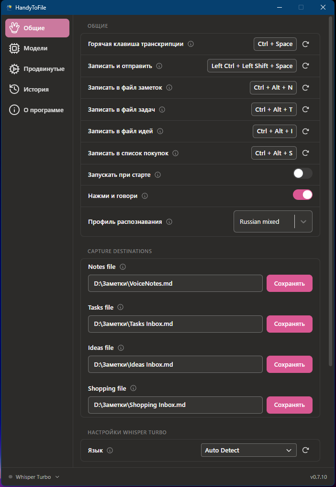
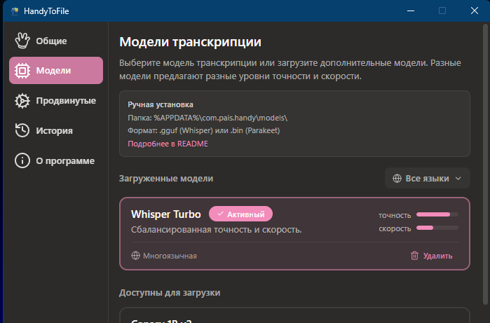
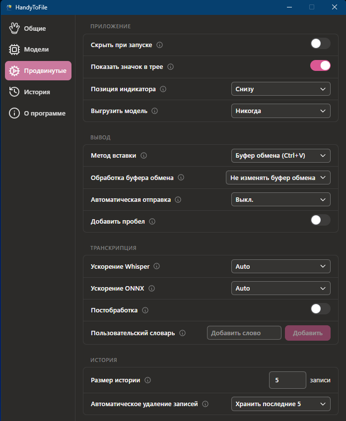
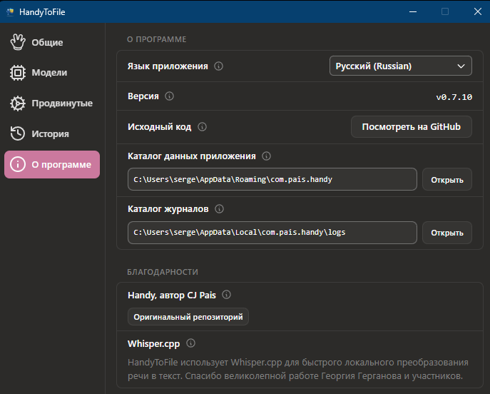

# HandyToFile

> Форк проекта [Handy](https://github.com/cjpais/Handy) — бесплатного офлайн-приложения для речевого ввода текста.
> Добавлена запись расшифровок в Markdown-файлы, профили распознавания и горячие клавиши для захвата по категориям.

**Платформы:** Windows · macOS · Linux

---

## Что добавлено в этом форке

- **Запись в файлы** — расшифровки сохраняются в Markdown-файлы (заметки, задачи, идеи, покупки)
- **«Записать и отправить»** — горячая клавиша `Ctrl+Shift+Enter` вставляет текст и нажимает Enter
- **Профили распознавания** — `ru_mixed`, `ru_only`, `en_only`, `raw`
- **Горячие клавиши для захвата** — `Ctrl+Alt+N/T/I/S` для записи по категориям
- **Русский интерфейс** — полная локализация настроек
- **Windows-совместимость** — скрипт запуска, инструкции для чистой установки

---

## Интерфейс

<table>
<tr>
<td><b>Общие настройки</b><br>Горячие клавиши, профиль распознавания, пути к Markdown-файлам</td>
<td><b>Модели</b><br>Управление моделями, ручная установка</td>
</tr>
<tr>
<td></td>
<td></td>
</tr>
<tr>
<td><b>Продвинутые настройки</b><br>Ускорение Whisper/ONNX, постобработка, история</td>
<td><b>О программе</b><br>Версия, каталоги данных, благодарности</td>
</tr>
<tr>
<td></td>
<td></td>
</tr>
</table>

---

## Быстрый старт (Windows)

Полная инструкция с нуля: [SETUP_WINDOWS.md](SETUP_WINDOWS.md)

**Что нужно установить:** Git, Rust, Visual Studio C++ Build Tools, Node.js, Vulkan SDK

```powershell
git clone https://github.com/Arzhaev/HandyToFile.git C:\projects\HandyToFile
cd C:\projects\HandyToFile
npm install --ignore-scripts
powershell -ExecutionPolicy Bypass -File run-dev.ps1
```

При первом запуске скачать модель распознавания речи в настройках (раздел Модели).
Если автозагрузка не работает — [инструкция по ручной установке моделей](SETUP_WINDOWS.md#шаг-11--скачать-модель-распознавания-речи).

---

## Горячие клавиши

### Windows / Linux

| Действие | Клавиши | Описание |
|---|---|---|
| Записать → вставить в курсор | `Ctrl+Space` | Основной режим. Текст вставляется в активное поле |
| Записать → вставить и отправить | `Ctrl+Shift+Enter` | Вставить текст и нажать Enter (удобно для чатов) |
| Записать → постобработка | `Ctrl+Shift+Space` | Транскрипция с дополнительной обработкой через LLM |
| Записать → файл заметок | `Ctrl+Alt+N` | Дозапись в Markdown: `- YYYY-MM-DD HH:mm — текст` |
| Записать → файл задач | `Ctrl+Alt+T` | Дозапись в Markdown: `- [ ] YYYY-MM-DD HH:mm — текст` |
| Записать → файл идей | `Ctrl+Alt+I` | Дозапись в Markdown: `## YYYY-MM-DD HH:mm` + текст |
| Записать → файл покупок | `Ctrl+Alt+S` | Дозапись в Markdown: `- [ ] YYYY-MM-DD HH:mm — текст` |
| Отмена | `Escape` | Отменить текущую запись |

### macOS

| Действие | Клавиши |
|---|---|
| Записать → вставить в курсор | `Option+Space` |
| Записать → вставить и отправить | `Option+Shift+Return` |
| Записать → постобработка | `Option+Shift+Space` |
| Записать → файл заметок | `Cmd+Option+N` |
| Записать → файл задач | `Cmd+Option+T` |
| Записать → файл идей | `Cmd+Option+I` |
| Записать → файл покупок | `Cmd+Option+S` |
| Отмена | `Escape` |

**Режим работы:** по умолчанию Push-to-Talk — держать клавишу пока говоришь, отпустить для транскрипции. Toggle-режим (нажал → говоришь → нажал снова) включается в Настройки → Общие.

Все сочетания клавиш настраиваются в Настройках.

---

## Модели распознавания речи

### Whisper (многоязычный, 99 языков)

| Модель | Размер | Точность | Скорость | Примечания |
|---|---|---|---|---|
| Small | 487 МБ | ★★★☆☆ | ★★★★★ | Быстрая, подходит для несложных фраз |
| Medium | 492 МБ | ★★★★☆ | ★★★☆☆ | Хороший баланс, квантизована (q4) |
| **Turbo** | 1 600 МБ | ★★★★☆ | ★★☆☆☆ | **Рекомендуется при наличии GPU** |
| Large | 1 100 МБ | ★★★★★ | ★★☆☆☆ | Максимальная точность, квантизована (q5) |

### Parakeet (CPU-оптимизированный)

| Модель | Размер | Точность | Скорость | Языки |
|---|---|---|---|---|
| Parakeet V2 | 473 МБ | ★★★★★ | ★★★★★ | Только английский |
| **Parakeet V3** | 478 МБ | ★★★★☆ | ★★★★★ | 25 языков (en, ru, uk, de, fr, es, ...) |

### CPU vs GPU

| | CPU | GPU |
|---|---|---|
| Требования | Ничего дополнительно | Ничего дополнительно (см. ниже) |
| Скорость | Медленнее, особенно Turbo/Large | В 3–10× быстрее |
| Модели | Все работают | Все работают |
| Рекомендация | Small / Medium / Parakeet | Turbo / Large |

**GPU-ускорение на Windows не требует установки дополнительного ПО:**
- Whisper использует **Vulkan** — драйвер видеокарты (NVIDIA, AMD, Intel) уже включает поддержку Vulkan
- Parakeet использует **DirectML** — встроен в Windows 10/11, работает с любой DirectX 12 совместимой картой

Выбор ускорения: Настройки → Продвинутые → Транскрипция. По умолчанию `Auto` — приложение само определяет GPU. Можно принудительно выбрать `CPU` даже при наличии GPU.

> **Совет:** Parakeet V3 работает быстро даже без GPU и поддерживает русский язык — хороший вариант для слабых машин.

---

## Запись в Markdown-файлы

Каждая горячая клавиша записывает в свой файл в определённом формате:

| Категория | Формат записи |
|---|---|
| Заметки (`Ctrl+Alt+N`) | `- YYYY-MM-DD HH:mm — текст` |
| Задачи (`Ctrl+Alt+T`) | `- [ ] YYYY-MM-DD HH:mm — текст` |
| Идеи (`Ctrl+Alt+I`) | `## YYYY-MM-DD HH:mm` + текст абзацем |
| Покупки (`Ctrl+Alt+S`) | `- [ ] YYYY-MM-DD HH:mm — текст` |

Пути к файлам настраиваются в Настройки → Общие → Куда сохранять. Папка создаётся автоматически при первой записи.

По умолчанию:
```
C:/Users/<user>/Documents/HandyToFile/notes.md     (заметки)
C:/Users/<user>/Documents/HandyToFile/tasks.md     (задачи)
C:/Users/<user>/Documents/HandyToFile/ideas.md     (идеи)
C:/Users/<user>/Documents/HandyToFile/shopping.md  (покупки)
```

---

## Известные особенности поведения

### Галлюцинации Whisper при тишине

Если нажать горячую клавишу и ничего не сказать (или говорить очень тихо), Whisper может вставить случайный текст — например *«Спасибо за просмотр.»*, *«Субтитры сделаны...»* или случайные слова. Это известное ограничение модели Whisper: при отсутствии речи она «придумывает» текст вместо того чтобы вернуть пустой результат.

Приложение использует Silero VAD для фильтрации тишины до отправки аудио в Whisper, но при низком уровне фонового шума VAD может пропустить «пустой» фрагмент.

**Как избежать:** говорите сразу после нажатия клавиши, не делайте длинных пауз в начале.

---

## Настройки

Файл настроек: `%APPDATA%\com.pais.handy\settings.json`

---

## Разработка

### Windows

```powershell
# Запуск в режиме разработки
powershell -ExecutionPolicy Bypass -File run-dev.ps1

# Сборка релизного пакета
powershell -ExecutionPolicy Bypass -File build-release.ps1
```

Подробная инструкция с нуля: [SETUP_WINDOWS.md](SETUP_WINDOWS.md)

### macOS

Готовых бинарников под macOS пока нет — собрать можно самостоятельно из исходников:

**Требования:** [Rust](https://rustup.rs/), [Bun](https://bun.sh/), Xcode Command Line Tools

```bash
git clone https://github.com/Arzhaev/HandyToFile.git
cd HandyToFile

# Скачать модель VAD (обязательно)
mkdir -p src-tauri/resources/models
curl -o src-tauri/resources/models/silero_vad_v4.onnx https://blob.handy.computer/silero_vad_v4.onnx

# Установить зависимости
bun install

# Запуск в режиме разработки
bun run tauri dev

# Сборка релизного пакета (.dmg)
bun run tauri build
```

Подробности: [DEPLOYMENT_PLAN.md](DEPLOYMENT_PLAN.md) · [RELEASE_CHECKLIST.md](RELEASE_CHECKLIST.md)

---

## Лицензии

- Этот форк: [MIT License](LICENSE), © 2026 Arzhaev
- Оригинальный Handy: [MIT License](https://github.com/cjpais/Handy/blob/main/LICENSE), © 2025 CJ Pais
- whisper.cpp: [MIT License](vendor/whisper-rs-sys/whisper.cpp/LICENSE), © The ggml authors
- whisper-rs-sys: [Unlicense](vendor/whisper-rs-sys/LICENSE) (public domain)

## Благодарности

- **CJ Pais** — оригинальный проект [Handy](https://github.com/cjpais/Handy)
- **OpenAI** — модель Whisper
- **ggml / whisper.cpp** — инференс на CPU/GPU
- **Silero** — VAD (определение голосовой активности)
- **Tauri** — фреймворк приложения
